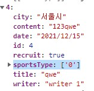

# TeamFinder - 스포츠 팀원을 구하는 커뮤니티 프로젝트

## HTML
## 시맨틱 태그
- artical 독자적으로 완성된 내용을 담고 있어야 하는 태그이다. 내 프로젝트에 있지만 독자적으로 완성되어 있는 날씨정보 같은 요소들이 있다.

- section 비슷한 요소들을 묶어주는 컨테이너라고 생각하면 된다.

## list 요소 정적으로 하드코딩 피하기
```javascript
  <li data-index="0">서울시</li>
  <li data-index="1">부산시</li>
  <li data-index="2">대구시</li>
  <li data-index="3">광주시</li>
  <li data-index="4">울산시</li>
  <li data-index="5">대전시</li>
  <li data-index="6">경기도</li>
  <li data-index="7">강원도</li>
  <li data-index="8">충청남도</li>
  <li data-index="9">충청북도</li>
  <li data-index="10">경상북도</li>
  <li data-index="11">경상남도</li>
  <li data-index="12">전라북도</li>
  <li data-index="13">전라남도</li>
  <li data-index="14">제주도</li>
```
- 위 리스트들의 수는 언제든지 변경될 수 있으므로 정적으로 html로 생성하는 것보다는 javascript로 동적으로 생성하는것이 효율성이 높다. 
- 이러한 요소들은 한번만 생성하는게 아닌 js파일을 분리해 리스트들만 담긴 객체에 배열을 담아 관리하는 것이 좋다.


# CSS
## CSS 변수
- 자주 사용하는 CSS 속성 디자인에 메인 색상 같은경우 css 변수로 관리해서 프로젝트 중간에 색상이 변경되어도 css 변수 내용 하나만 변경해주면 되기 때문에 유용하다.
```css
:root {
  --list-pick-color: rgb(38, 132, 255);
  --list-base-color: rgb(204, 204, 204);
}

.city.acitive{
  border: 2px solid var(--list-pick-color)
}
```
- root는 전역을 의미하는 것이고 특정 선택자에 변수를 선언하면 그 선택자가 적용되는 요소와 하위 요소에서 변수를 사용할 수 있습니다. 


## @media
- @media를 사용하면 뷰포트의 특정 크기가 되면 css 속성을 변경하는데 바꾸려는 요소의 css보다 위에서 선언될 경우 무시되므로 반드시 바꾸려논 요소보다 아래 작성해야 한다.
- 위 이슈 때문에 `!important`를 사용하였지만 안티패턴이므로 `!important`는 기피해야 한다.


# JavaScript

## 비동기 처리
- async/await와 Promise.prototype.catch 모두 에러를 캐치할 수 있지만, 비동기 처리 관련 코드가 길어지면 then 내부가 길어져 가독성이 떨어질 수 있음. async / await을 사용해 try catch로 에러처리 하는 습관을 들이자.

```javascript
const postingSend = async payload => {
  try {
    const res = await fetch('/api/postings', {
      method: 'POST',
      headers: { 'content-Type': 'application/json' },
      body: JSON.stringify(payload),
    });
    if (!res.ok) throw new Error(res.status);
  } catch (error) {
    console.log(error);
  }
};
```
- catch 구문에서 error 를 캐치해도 프로그램이 종료되지 않기 때문에 throw로 사용자가 직접 에러를 발생시켜 프로그램에 실행을 중단시킵니다.


## 자주쓰는 함수
```javascript
const todayFormat = () => {
  const today = new Date();
  const format = num => (num < 10 ? `0${num}` : `${num}`);
  return `${today.getFullYear()}-${format(today.getMonth() + 1)}-${format(today.getDate())}`;
};
```
- 위와 같은 today에 날짜를 가져와 데이터 포맷을 맞춰는 함수는 언제 어디서든 사용할 수 있으므로 따로 분리해서 관리해야 한다.


## 모듈
- 애플리케이션을 구성하는 개별적 요소로서 재사용 가능한 코드 조각을 말한다.
- 다른 디렉토리에 있는 특정 코드를 가져올 때는 import {가져올 내용} from '가져올 코드 디렉토리 위치'
- 가져오기 위해서는 작성한 코드를 export 해야한다. 코드 각각의 export할 수도 있고 한번에 export{'', '', ''} 내보낼 수도 있다.
- 중요한 점은 진입점이 있는 javascirpt 파일을 `<script type ="module">`로 명시를 해줘야만 import export를 사용할 수 있다.


## 데이터 타입 



- 위와 같이 api에 데이터를 payload에 담아서 보내주기 위해 특정 데이터 값을 추출할 때 숫자 값이라고 인식하고 보내는 경우가 발생하기 때문에 다시 한번 생각하는 습관을 가져야 한다.

- 데이터는 서울시, 인천시 같은 데이터라도 sportsType처럼 약속을 만들어 보내줘야 메모리 공간을 효율적이게 사용할 수 있다. 

- `['서울시', '인천시', '경기도']` 약속된 인덱스 값을 넘겨주기 위해 해당 페이지에서 매번 이러한 배열을 만드는 것보다 이런 약속된 배열들은 특정 파일에 저장해서 불러와서 쓰는게 시간도 단축되고 요구사항이 변경되어도 쉽게 변경할 수 있다.

```javascript
export const initialFilter = {
  sports: ['배드민턴', '야구', '농구', '당구', '볼링', '축구', '런닝'],
  cities: [
    '서울시',
    '부산시',
    '대구시',
    '광주시',
    '울산시',
    '대전시',
    '경기도',
    '강원도',
    '충청남도',
    '충청북도',
    '경상북도',
    '경상남도',
    '전라북도',
    '전라남도',
    '제주도',
  ],
};
```

## 이벤트 위임 
```javascript

// 이벤트 위임 방식
$citySportsWrap.addEventListener('click', e => {
  if (!(e.target.matches('.writing-one-delete')) return;
  e.target.parentNode.parentNode.remove();
};

// 이벤트 리스너 직접 달기
$cityContainer.addEventListener('click', () => $cityList.remove());
$cityContainer.addEventListener('click', () => sportsList.remove());
```
- 프로젝트를 하다 보면 수 없이 많은 이벤트 처리를 해야한다.
- 위와 같이 이벤트를 직접 다는 방식과 이벤트를 상위 요소에서 발생시키고 버블링 단계에서 catch에서 사용하는 방식이 있다.
- 사실 처음에는 개별적으로 이벤트를 다는게 가독성 측면에서 직관적으로 파악할 수 있다고 생각해서 일일히 달다보니 중복되는 이벤트가 너무 많이 생겼다.
- 그래서 이벤트 위임 방식으로 변경하였는데 e.target.parentNode.parentNode 같이 요소가 이벤트가 발생한 지점보다 멀리있을 경우 일일히 그 요소가 무엇을 가르키는지 주석을 달아줘야한다.
- 하지만 e.target.closest으로 이벤트 타겟에 조상요소를 바로 접근할 수 있다.
- `e.target.closest('.writing-container').remove`이러한 방식으로 명시적으로 어떤 요소인지 확인할 수 있기때문에 위벤트 위임과 closet을 사용하는게 용이한거 같다.
